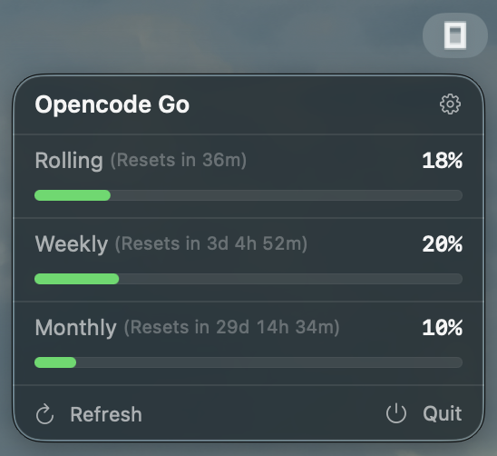
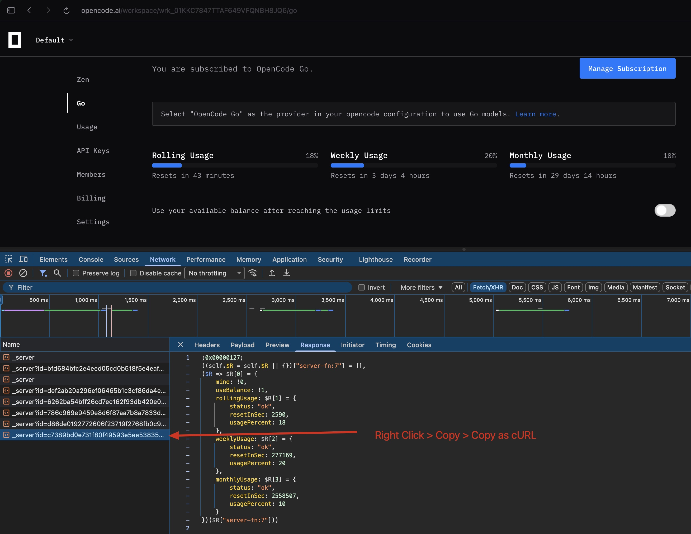

# OpenCode Usage Monitor

A native macOS Menu Bar application built with SwiftUI to easily monitor your Opencode Go subscription usage (Rolling, Weekly, and Monthly limits).

 <!-- Add your app screenshot here in the 'assets' folder -->

## Features

- **Real-Time Monitoring**: View your Rolling, Weekly, and Monthly usage directly from the menu bar.
- **Smart Progress Bars**: Progress bar colors dynamically change based on usage levels (Green for safe, Yellow for medium, Red for critical).
- **Auto-Refresh**: Automatically fetches new data every 5 minutes, or you can manually refresh.
- **Lightweight**: Runs as a background agent (`LSUIElement`) with no dock icon clutter.
- **Terminal-Driven**: No Xcode GUI required. Generated and built entirely via `xcodegen` and `make`.

## Prerequisites

- macOS with Command Line Tools / Xcode installed.
- [XcodeGen](https://github.com/yonaskolb/XcodeGen) (can be installed via Homebrew: `brew install xcodegen`).

## Installation & Setup

1. **Clone the repository** (or navigate to the project directory):
   ```bash
   cd opencode-usage
   ```

2. **Generate the Xcode project and build**:
   ```bash
   make build
   ```

3. **Run the app**:
   ```bash
   make run
   ```
   *(Note: The app will appear in your macOS Menu Bar. It does not have a dock icon).*

## Configuration: How to Get Your Credentials

> **Note:** Currently, Opencode does not provide an official API or dedicated endpoint to fetch usage statistics. As a workaround, this app parses the payload directly from the web client's internal `_server` requests.

To fetch your usage data, the app needs your Opencode API URL and Authentication Cookie. You can grab these easily using your browser's Developer Tools.

1. Open your opencode console.
2. Open the **Developer Tools** (Right-click anywhere on the page -> **Inspect**).
3. Go to the **Network** tab.
4. Refresh the page or interact with the Opencode UI until you see a network request made to `_server` (or `https://opencode.ai/_server?...`).
5. Right-click on that `_server` request, select **Copy**, then choose **Copy as cURL (bash)**.

   

6. Open the **OpenCode Usage Monitor** from your Mac menu bar.
7. Click the **Settings (⚙️)** icon in the top right corner of the header.
8. Paste the entire `curl` command into the text box and click **Save**.

The app will automatically extract your endpoint, headers, and authentication tokens to keep your usage updated!

## Development Commands

A `Makefile` is provided for easy terminal workflows:

- `make setup`: Generates the `.xcodeproj` using XcodeGen.
- `make build`: Builds the application (Debug configuration).
- `make run`: Kills any existing instance and runs the freshly built app.
- `make clean`: Removes the generated `.xcodeproj` and the `build/` directory.
- `make logs`: Streams the unified logs specifically for this app subsystem (`com.wiscaksono.opencode-usage`).

## License

MIT License
